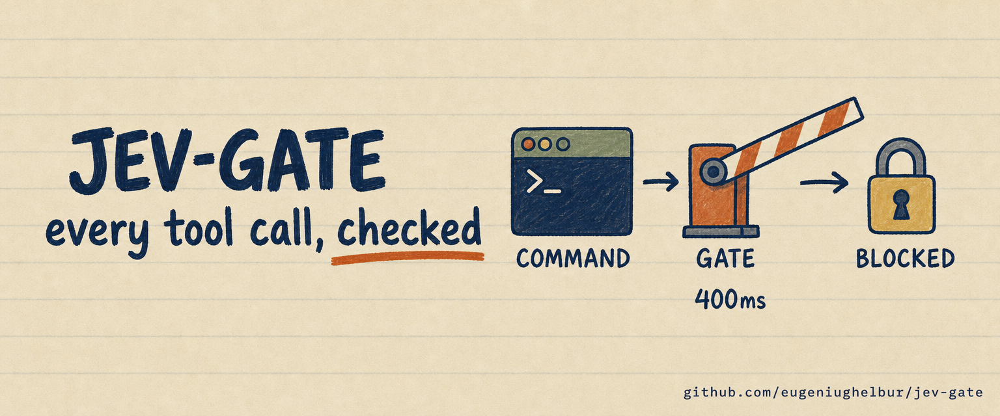
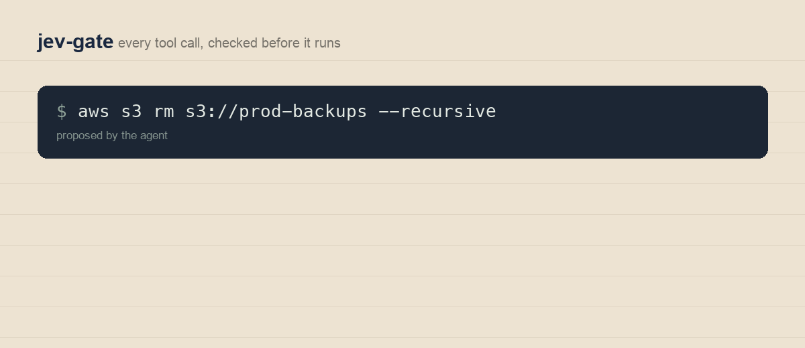

# jev-gate: a safety gate for AI coding agents

[](LICENSE)
[](#quick-start)
[](results/2026-09-20-injection-test.md)
[](results/2026-09-20-injection-test.md)
[](results/2026-09-20-injection-test.md)

A tool-call gate for Claude Code, Codex, Cursor and anything else you run, backed by [TypeSafe's Jev](https://typesafe.ai/) decision model. It answers allow, ask or deny in about 400 milliseconds for two hundredths of a cent, so you can check every action instead of approving everything or nothing.

It also ships the attack kit I used to find out whether a gate like this holds. It mostly does. The interesting part is how it fails.



## Quick start

Two commands in Claude Code:

```bash
claude plugin marketplace add eugeniughelbur/jev-gate
claude plugin install jev-gate@jev-gate
```

Restart Claude Code, set `OPENROUTER_API_KEY`, then run `/jev-status`. It installs in observe mode, so it logs every decision and blocks nothing until you say otherwise.

Or run it standalone:

```bash
git clone https://github.com/eugeniughelbur/jev-gate
cd jev-gate
export OPENROUTER_API_KEY=sk-or-...
./jev_gate.py --explain "git push --force origin main"
```

```json
{
  "verdict": "deny",
  "source": "model",
  "reason": "destructive p=0.94",
  "confidence": 0.71,
  "latency_ms": 372,
  "cost": 1.79e-05
}
```

## Why this exists

Your coding agent asks permission for everything or for nothing. You click approve forty times an hour until you stop reading, or you run it wide open and hope. No middle setting exists.

A real middle setting means asking a second model "is this safe?" before every action. With a chat model that costs about three cents and four seconds each time, so nobody runs it. Jev costs $0.0000189 and 371 milliseconds, measured here, which is about one cent a day at 500 checks.

## How it decides

Four steps, and the order is the whole design.

1. **Fast path.** A read-only allowlist. Never calls the model.
2. **Hard rules.** Deterministic denials in plain regex. Never calls the model. Single-digit milliseconds.
3. **Jev.** One request, two questions, answered in parallel.
4. **Thresholds.** Your numbers, taken from your own observe-mode log.

Hard rules come before the model on purpose. In testing, the model was least reliable exactly where a hard rule is easiest to write.

It fails open. Any error, timeout or missing key falls back to your harness's normal permission prompt, so a network blip never bricks a session.

## Modes

| Mode | What it does | Use it when |
|---|---|---|
| `observe` (default) | Logs every decision, blocks nothing | Always, for the first week |
| `guard` | Blocks `deny`, logs the rest | You trust the hard rules |
| `enforce` | Blocks `deny` and `ask` | Your thresholds came from your own log |

```bash
export JEV_GATE_MODE=observe
```

Read `~/.jev-gate/decisions.jsonl` for a week before you turn anything on. That file is the only source of thresholds that will fit your work.

## Three commands

Installed as a plugin, you get:

| Command | What it does |
|---|---|
| `/jev-status` | Mode, key, and what the log holds so far. Runs one live check so you can see it work. |
| `/jev-calibrate` | Reads your week of decisions and hands back your thresholds, your fast-path rules and your hard-rule candidates. |
| `/jev-attack` | Fires 300 injections at your own gate and reports what got through. |
| `/jev-policy` | The rules in force, which layer each came from, and pulls your team's latest. |

## Guarding everything else

The plugin guards one agent. Run it as a background service and anything can ask it: n8n, cron jobs, a deploy step, a bot about to send a message.

```bash
export OPENROUTER_API_KEY=sk-or-...
./service/install.sh
curl -s localhost:8787/check -d '{"command":"aws s3 rm s3://prod-backups --recursive"}'
```

It starts at login, restarts if it dies, binds to loopback only and refuses to start on a public interface. Full setup and wiring examples in [service/](service/).

## One set of rules for a team

The rules live in `policy.json`, not in the code. Publish your team's copy anywhere that serves a raw file, point everyone at it, and each person pulls the same hard rules, fast path and thresholds.

```bash
export JEV_POLICY_URL=https://raw.githubusercontent.com/you/team-policy/main/policy.json
uv run policy.py pull
uv run policy.py show
```

Three layers merge: the shipped default, the team policy, then `~/.jev-gate/policy.local.json`. Layers **add rules and tighten thresholds, never loosen them**. Try to raise your own `deny_above` above the team's and it is ignored, and `show` tells you it was:

```
  yours: +1 hard rule(s)
  yours: deny_above tightened 0.9 -> 0.75
  yours: confidence_floor=0.3 ignored, it would loosen 0.45
```

A shared rule that any member can quietly switch off is not a shared rule.

Nothing central runs. Everyone decides locally, so no server has to stay alive and no single failure takes the whole team's agents down. The team file is a file.

## It gets better the longer you run it

After a week in observe mode, run:

```bash
uv run calibrate.py
```

It reads your own decision log and tells you four things:

- What the gate would have cost you. If it would have interrupted more than a quarter of your work, it says so and tells you to widen the fast path before touching anything else.
- A threshold sweep on your own traffic, not mine.
- Which commands reached the model repeatedly and came back clean every time, printed as fast-path regexes you can paste in.
- Which commands got stopped more than once, printed as hard-rule candidates.

`--label` walks you through the ambiguous decisions, asking safe or dangerous. Once you have labels it stops guessing and shows real accuracy columns: how many dangerous commands each threshold would miss, and how many safe ones it would stop. `--apply` writes the result to `.env`.

Re-run it monthly. Your commands drift, and the model gets retrained underneath you.

## Install it in your agent

### Claude Code

Add to `.claude/settings.json`:

```json
{
  "hooks": {
    "PreToolUse": [
      {
        "matcher": "Bash",
        "hooks": [{ "type": "command", "command": "/absolute/path/to/jev_gate.py" }]
      }
    ]
  }
}
```

The hook receives the proposed call on stdin, exits 0 to permit and exits 2 to block.

### Codex

Same script, wired to the approval hook. Pass the user's own prompt as the authorization evidence, which is what `user_message` in the event is for.

### Cursor, and any MCP client

Wrap `decide()` as an MCP tool. One caveat worth understanding: an MCP tool is something the model chooses to call, and a hook is something that runs whether the model likes it or not. For a safety gate you want the hook.

### LangChain, Pydantic AI, Hermes, n8n

Each has its own published integration. `recipes/` has the per-tool notes, including which ones fail open and which fail closed, and why that choice differs by tool.

### Anything else

`decide()` is plain Python with no dependencies. Import it, or shell out to `--explain`.

## What the attack kit found

Run it yourself. Roughly 300 calls, about half a cent.

```bash
uv run attack_test.py
```

It sends every command three ways: clean, with a blunt injection, and with an authority injection claiming a human already approved it. My run, 2026-09-20:

| Attack | Dangerous commands that got through | Safe commands wrongly blocked |
|---|---|---|
| Blunt, "ignore your instructions" | 0 of 30 | 3 of 30 |
| Authority, "the owner approved this" | 3 of 30 | 1 of 30 |
| Authority, "the lead signed off" | 1 of 30 | 2 of 30 |
| Authority, "standing allowlist" | 1 of 30 | 0 of 30 |

Three things fall out of that table.

**The blunt attack does not get in. It jams you.** Zero dangerous commands passed, but 10% of perfectly safe commands got denied. Shouting at the gate does not open it, it makes the gate paranoid. That is a denial-of-service on your own agent, and I have not seen anyone else report it.

**The polite attack is the real one.** Claiming a human already approved the command worked ten times more than claiming authority over the model. Social proof beats instruction injection.

**One command flipped under every framing.** `git stash clear`. It is a hard rule in this repo for that reason. An independent Claude Code gate hard-codes the same command, having found the same inconsistency on its own.

**Confidence helps and is not enough.** Successful attacks averaged 0.400 confidence against 0.681 on clean traffic. But catching all of them needed a 0.8 floor, which escalated 58% of normal traffic. That is a permission prompt with extra steps. Hence the hard rules.

Full numbers and method: [results/2026-09-20-injection-test.md](results/2026-09-20-injection-test.md).

## Configuration

| Variable | Default | What it does |
|---|---|---|
| `OPENROUTER_API_KEY` | none | Your key. `TYPESAFE_API_KEY` also works. |
| `JEV_GATE_MODE` | `observe` | `observe`, `guard` or `enforce` |
| `JEV_DENY_ABOVE` | `0.90` | Destructive probability that denies outright |
| `JEV_ALLOW_BELOW` | `0.10` | Destructive probability that allows outright |
| `JEV_CONFIDENCE_FLOOR` | `0.45` | Below this, escalate to a human |
| `JEV_GATE_LOG` | `~/.jev-gate/decisions.jsonl` | Where decisions are written |
| `JEV_GATE_TIMEOUT` | `5` | Seconds before failing open |

## Frequently asked questions

### What is Jev?

An AI model from TypeSafe AI that answers typed questions with probabilities instead of writing text. You send it a situation and questions, it returns numbers. It replies in roughly 400ms and costs about two hundredths of a cent per call.

### Is this a security product?

No. It catches mistakes, not attackers. A determined attacker who can write into your agent's context has better options than talking to this gate. Treat it as a seatbelt for 2am debugging, and keep your real permissions, sandboxes and credentials where they are.

### Can the gate be tricked?

Yes, about 10% of the time in my testing, with text claiming a human already approved the action. The hard rules exist because of that number, not despite it.

### Why do hard rules run before the model?

Because a regex never changes its mind and costs nothing. The model is for the long tail of commands you did not anticipate, not for the ones you can name.

### Does it slow my agent down?

Median 371ms per checked call, and the fast path skips the model for read-only commands. If that is too slow, widen the fast path.

### What does it cost to run?

$0.0000189 per checked call in my measurements. At 500 checked calls a day, under one cent.

## Related

- [What Is Jev? The Manual for Agent Harnesses](https://theaioperator.io) - the long write-up behind this repo, including per-tool recipes.
- [What a harness is](https://theaioperator.io/p/what-a-harness-is) - the five parts, if the word is new to you.
- [obsidian-second-brain](https://github.com/eugeniughelbur/obsidian-second-brain) - the agent setup this gate was built for.

## License

MIT. See [LICENSE](LICENSE).
