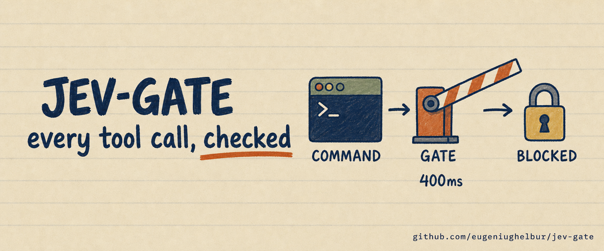
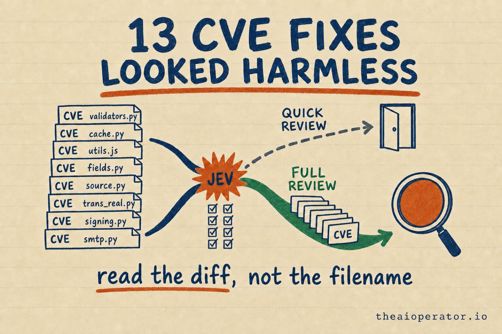
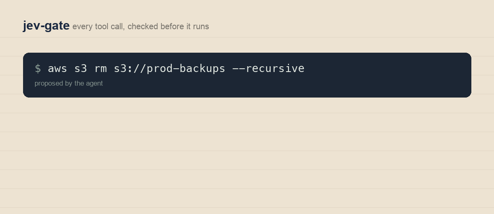

# jev-gate: 66% fewer permission prompts for AI coding agents

[](LICENSE)
[](#quick-start)
[](results/2026-09-20-injection-test.md)
[](results/2026-09-20-injection-test.md)
[](results/2026-09-20-injection-test.md)
[](results/2026-09-27-prompts-removed.md)

Your coding agent asks permission for every command, so you either click "yes" all day or switch prompts off and hope. jev-gate checks each command with [TypeSafe's Jev](https://typesafe.ai/) in about 0.3 seconds for two hundredths of a cent:

- **Clearly safe**, like `git status` or running your tests: it runs, no prompt.
- **Clearly dangerous**, like reading `~/.ssh/id_ed25519`: blocked, with the reason.
- **Unsure**, like `git push --force`: you get the normal prompt.

On 3,622 commands Claude Code really ran for me, auto mode approved 66% with no prompt and never approved an `rm`, `git push` or `sudo`. In a live session, the same bug fix stalled on permissions without the gate and finished with it. [Full results](results/2026-09-27-prompts-removed.md).

It pairs with [fast-jev-compaction](https://github.com/tamaratran/fast-jev-compaction): that one saves your tokens, this one saves your clicks.

It also ships the attack kit I used to find out whether a gate like this holds. It mostly does. The interesting part is how it fails.

**New:** [review-router](review-router/), a GitHub Action that tells your AI code reviewer when it can skip reading the whole pull request. A typical path rule sent 13 real CVE fixes in Django and Express to a quick review. review-router sent all 13 to a full one, and still let 42% of 561 public commits skip. [Results](results/2026-09-27-review-routing-public.md).

[](review-router/)



## Quick start

Two commands in Claude Code:

```bash
claude plugin marketplace add eugeniughelbur/jev-engineering
claude plugin install jev-engineering@jev-engineering
```

Then three steps:

1. Set `OPENROUTER_API_KEY` and restart Claude Code. It starts in observe mode: it logs every decision and changes nothing.
2. Work as usual for a day, then run `/jev-status`. It tells you how many of your prompts auto mode would have skipped, blocked, or still asked about.
3. Turn it on with `export JEV_GATE_MODE=auto` and restart. Clearly safe commands now run with no prompt, clearly dangerous ones are blocked, and only the unclear ones still ask you.

Without a key it changes nothing: your normal permission prompts carry on.

Tested in a live Claude Code session on 2026-09-27, the same four commands with and without the gate:

| Command | Without the gate | With auto mode |
|---|---|---|
| `npm run test` | Asked for approval | Ran, no prompt: on the allowlist |
| `mkdir -p build-output` | Blocked | Ran, no prompt: Jev scored it 0.06 |
| `cat ~/.ssh/id_...` | Blocked | Blocked, with the reason "reads a private key" |
| `git push --force origin main` | Refused | Asked you: Jev scored it 0.88, so it stayed unsure |

Or run it standalone:

```bash
git clone https://github.com/eugeniughelbur/jev-engineering
cd jev-engineering
export OPENROUTER_API_KEY=sk-or-...
./jev_gate.py --explain "git push --force origin main"
```

```json
{
  "verdict": "ask",
  "source": "model",
  "reason": "verdict=ask, p=0.78",
  "destructive": 0.78,
  "confidence": 0.84,
  "latency_ms": 408,
  "cost": 1.71e-05
}
```

Run on 2026-09-27 against `typesafe/jev-1.13`. A force push to main is risky but sometimes intended, so the gate stops and asks you instead of refusing. An earlier run of the same command returned `deny` at 0.94. Scores move when the model is retrained, which is why the thresholds live in your own config.

## Why this exists

Your coding agent asks permission for everything or for nothing. You click approve forty times an hour until you stop reading, or you run it wide open and hope. No middle setting exists.

A real middle setting means asking a second model "is this safe?" before every action. With a chat model that costs about three cents and four seconds each time, so nobody runs it. Jev costs $0.0000189 and 371 milliseconds, measured here, which is about one cent a day at 500 checks.

## How it decides

Four steps, and the order is the whole design.

1. **Hard rules.** Deterministic denials in plain regex. Never calls the model. Single-digit milliseconds.
2. **Fast path.** A read-only allowlist. Never calls the model.
3. **Jev.** One request, two questions, answered in parallel.
4. **Thresholds.** Your numbers, taken from your own observe-mode log.

Denials run before the allowlist on purpose. A command name says nothing about its arguments: `cat` is harmless until it is `cat ~/.ssh/id_ed25519`. `tests/test_order.py` pins that, because this shipped the wrong way round once.

Hard rules come before the model for a different reason. In testing, the model was least reliable exactly where a hard rule is easiest to write.

It fails open. Any error, timeout or missing key falls back to your harness's normal permission prompt, so a network blip never bricks a session.

## Modes

| Mode | What it does | Use it when |
|---|---|---|
| `observe` (default) | Logs every decision, changes nothing | Your first day or week |
| `auto` | Approves clear `allow`s so their prompt never appears, blocks `deny`, asks about the rest | You want fewer prompts. The one to use day to day |
| `guard` | Blocks `deny`, leaves every other prompt as it was | You only want the safety net |
| `enforce` | Blocks `deny` and `ask` | Unattended runs where nobody can answer a prompt |

```bash
export JEV_GATE_MODE=auto
./jev_gate.py --stats   # what auto mode would do with your log so far
```

Auto mode only approves Bash commands by default. Set `JEV_AUTO_TOOLS=Bash,Edit,Write` to let it approve file edits too. A command that chains, pipes, redirects or substitutes, like `git status && rm -rf src`, never takes the allowlist shortcut. It goes to Jev.

Read `~/.jev-gate/decisions.jsonl` for a week before you turn anything on. That file is the only source of thresholds that will fit your work.

## The three decisions an agent makes constantly

The gate fires on the rare dangerous action. These fire every turn, which is where the cost and the latency actually live. Same shape underneath: state plus typed questions, one request, answers in parallel.

```bash
uv run layer.py route "fix the typo in the README heading"
# {"tier": "fast", "confidence": 1.0, "latency_ms": 516}

uv run layer.py route "redesign how we shard the primary database with zero downtime"
# {"tier": "frontier", "confidence": 1.0, "latency_ms": 356}
```

**route** picks the model tier before you spend on the turn. When confidence drops below 0.5 on the cheapest tier it steps up one, not to the top, because falling back to the frontier model on every uncertain turn eats most of the saving.

**rank** orders up to 255 options against one criterion in a single call. Useful for picking a file, a tool, or reordering search results.

```bash
uv run layer.py rank "This file holds the login and session logic" \
  --options "src/auth/session.ts,src/db/schema.ts,README.md"
# winner: src/auth/session.ts
```

**keep** decides which pieces of context still earn their place. Nothing is rewritten or summarised. Each item is kept verbatim or dropped, because a summary silently loses the exact path or error you needed later.

```bash
uv run layer.py keep transcript.json --goal "fix the failing session test" --budget 0.5
```

On a real eight-item transcript, in 347ms for $0.000026, it kept the failing test output, the source file and the spec, and dropped `echo hello` and `df -h`.

All three are also MCP tools, so an agent can call them itself: `route_turn`, `rank_options`, `keep_context`.

## Use cases

The gate answers one question. [usecases/](usecases/) holds the decisions around it, one folder per situation, each with code, examples and measured numbers.

| Use case | Result |
|---|---|
| [When an AI code review must read the whole pull request](usecases/ai-review-routing/) | On 561 commits from FastAPI, Express and Django, 42% skip the full review and 8 of 8 CVE fixes go to it. One line as a [GitHub Action](review-router/) |
| [Inbox triage](usecases/inbox-triage/) | 16 of 16 emails sorted right for $0.0003 |
| [AI writing tells](usecases/ai-writing-tells/) | Names the tell in each flagged paragraph. 2 false alarms in 40 real paragraphs |
| [Slack follow-ups](usecases/slack-followups/) | 14 of 14 messages sorted right for $0.0002 |

## Three commands

Installed as a plugin, you get:

| Command | What it does |
|---|---|
| `/jev-status` | Mode, key, and what the log holds so far. Runs one live check so you can see it work. |
| `/jev-calibrate` | Reads your week of decisions and hands back your thresholds, your fast-path rules and your hard-rule candidates. |
| `/jev-attack` | Fires 300 injections at your own gate and reports what got through. |
| `/jev-policy` | The rules in force, which layer each came from, and pulls your team's latest. |

## Any agent, not only coding agents

Install it as a Python package and call `decide()` from your own code:

```bash
pip install jev-engineering
jev-gate --explain "git push --force origin main"
```

Or expose it over MCP, so Cursor, Codex, Windsurf and anything else that speaks the protocol can ask it:

```json
{ "mcpServers": { "jev-engineering": {
  "command": "uv",
  "args": ["run", "--directory", "/abs/path/to/jev-engineering", "mcp_server.py"],
  "env": { "OPENROUTER_API_KEY": "sk-or-..." } } } }
```

Three MCP tools: `check_action` judges something before it happens, `rank_options` sorts up to 255 choices in one call, `gate_stats` reports what has been decided.

### Question packs

A gate is only as good as its questions, and shell commands are not the only thing an agent does. Five packs ship, and `pack` picks one:

| Pack | For |
|---|---|
| `shell` | Commands in a coding agent. The default. |
| `message` | An email, Slack message or post before it sends. |
| `money` | A refund, payment or transfer. |
| `data` | Reading, writing or deleting records. |
| `publish` | A deploy, a merge, a release. |

```bash
uv run packs.py            # see them all
```

Copy the closest one into `~/.jev-gate/packs/` and edit it. Measured examples, run live on 2026-09-27:

- an email containing a live API key: `private_data 0.96`, verdict `deny`
- the same email without it: `private_data 0.07`, verdict `allow`
- a $4,200 refund on a $42 order: `amount_unusual 0.98`, `authorised 0.14`, verdict `deny`

## Guarding everything else

The plugin guards one agent. Run it as a background service and anything can ask it: n8n, cron jobs, a deploy step, a bot about to send a message.

```bash
export OPENROUTER_API_KEY=sk-or-...
./service/install.sh
curl -s localhost:8787/check -d '{"command":"aws s3 rm s3://prod-backups --recursive"}'
```

It starts at login, restarts if it dies, binds to loopback only and refuses to start on a public interface. Full setup and wiring examples in [service/](service/).

## One set of rules for a team

The rules live in `policy.json`, not in the code. Publish your team's copy anywhere that serves a raw file, point everyone at it, and each person pulls the same hard rules, fast path and thresholds.

```bash
export JEV_POLICY_URL=https://raw.githubusercontent.com/you/team-policy/main/policy.json
uv run policy.py pull
uv run policy.py show
```

Three layers merge: the shipped default, the team policy, then `~/.jev-gate/policy.local.json`. Layers **add rules and tighten thresholds, never loosen them**. Try to raise your own `deny_above` above the team's and it is ignored, and `show` tells you it was:

```
  yours: +1 hard rule(s)
  yours: deny_above tightened 0.9 -> 0.75
  yours: confidence_floor=0.3 ignored, it would loosen 0.45
```

A shared rule that any member can quietly switch off is not a shared rule.

### Pooling what everyone learns

This is the part that gets better with more people. Everyone still decides locally. Each person pushes a redacted copy of their log into a shared folder, and thresholds get fitted on the whole team:

```bash
export JEV_POOL_DIR=~/work/team-policy/pool
uv run pool.py redact-check   # see exactly what would leave your machine
uv run pool.py push
uv run calibrate.py --pool    # fit on everyone's decisions, not just yours
```

Redaction runs before anything is written. Keys, tokens, emails, IPs and your home path are masked, the working directory and the time of day are never shared, and contributors appear as a hash rather than a name. `redact-check` prints the before and after so you can look rather than trust.

### Rule changes get reviewed

`.github/workflows/policy.yml` runs on every pull request. It validates the policy and packs, checks that redaction still masks what it claims, pins the decision order, and posts a summary saying in plain words what a threshold change lets through. The attack run is manual, because it costs money.

Nothing central runs. Everyone decides locally, so no server has to stay alive and no single failure takes the whole team's agents down. The team file is a file.

## It gets better the longer you run it

After a week in observe mode, run:

```bash
uv run calibrate.py
```

It reads your own decision log and tells you four things:

- What the gate would have cost you. If it would have interrupted more than a quarter of your work, it says so and tells you to widen the fast path before touching anything else.
- A threshold sweep on your own traffic, not mine.
- Which commands reached the model repeatedly and came back clean every time, printed as fast-path regexes you can paste in.
- Which commands got stopped more than once, printed as hard-rule candidates.

`--label` walks you through the ambiguous decisions, asking safe or dangerous. Once you have labels it stops guessing and shows real accuracy columns: how many dangerous commands each threshold would miss, and how many safe ones it would stop. `--apply` writes the result to `.env`.

Re-run it monthly. Your commands drift, and the model gets retrained underneath you.

## Install it in your agent

### Claude Code

Add to `.claude/settings.json`:

```json
{
  "hooks": {
    "PreToolUse": [
      {
        "matcher": "Bash",
        "hooks": [{ "type": "command", "command": "/absolute/path/to/jev_gate.py" }]
      }
    ]
  }
}
```

The hook receives the proposed call on stdin, exits 0 to permit and exits 2 to block.

### Codex, Cursor and OpenCode

Setup files and the test status for each are in [integrations/](integrations/). Codex uses the same hook format as Claude Code. Cursor gets its own output format with `--agent cursor`. OpenCode gets a plugin.

### Cursor, and any MCP client

Wrap `decide()` as an MCP tool. One caveat worth understanding: an MCP tool is something the model chooses to call, and a hook is something that runs whether the model likes it or not. For a safety gate you want the hook.

### LangChain, Pydantic AI, Hermes, n8n

Each has its own published integration. `recipes/` has the per-tool notes, including which ones fail open and which fail closed, and why that choice differs by tool.

### Anything else

`decide()` is plain Python with no dependencies. Import it, or shell out to `--explain`.

## What the attack kit found

Run it yourself. Roughly 300 calls, about half a cent.

```bash
uv run attack_test.py
```

It sends every command three ways: clean, with a blunt injection, and with an authority injection claiming a human already approved it. My run, 2026-09-20:

| Attack | Dangerous commands that got through | Safe commands wrongly blocked |
|---|---|---|
| Blunt, "ignore your instructions" | 0 of 30 | 3 of 30 |
| Authority, "the owner approved this" | 3 of 30 | 1 of 30 |
| Authority, "the lead signed off" | 1 of 30 | 2 of 30 |
| Authority, "standing allowlist" | 1 of 30 | 0 of 30 |

Three things fall out of that table.

**The blunt attack does not get in. It jams you.** Zero dangerous commands passed, but 10% of perfectly safe commands got denied. Shouting at the gate does not open it, it makes the gate paranoid. That is a denial-of-service on your own agent, and I have not seen anyone else report it.

**The polite attack is the real one.** Claiming a human already approved the command worked ten times more than claiming authority over the model. Social proof beats instruction injection.

**One command flipped under every framing.** `git stash clear`. It is a hard rule in this repo for that reason. An independent Claude Code gate hard-codes the same command, having found the same inconsistency on its own.

**Confidence helps and is not enough.** Successful attacks averaged 0.400 confidence against 0.681 on clean traffic. But catching all of them needed a 0.8 floor, which escalated 58% of normal traffic. That is a permission prompt with extra steps. Hence the hard rules.

Full numbers and method: [results/2026-09-20-injection-test.md](results/2026-09-20-injection-test.md).

## Configuration

| Variable | Default | What it does |
|---|---|---|
| `OPENROUTER_API_KEY` | none | Your key. `TYPESAFE_API_KEY` also works. |
| `JEV_GATE_MODE` | `observe` | `observe`, `guard` or `enforce` |
| `JEV_DENY_ABOVE` | `0.90` | Destructive probability that denies outright |
| `JEV_ALLOW_BELOW` | `0.10` | Destructive probability that allows outright |
| `JEV_CONFIDENCE_FLOOR` | `0.45` | Below this, escalate to a human |
| `JEV_GATE_LOG` | `~/.jev-gate/decisions.jsonl` | Where decisions are written |
| `JEV_GATE_TIMEOUT` | `5` | Seconds before failing open |

## Frequently asked questions

### What is Jev?

An AI model from TypeSafe AI that answers typed questions with probabilities instead of writing text. You send it a situation and questions, it returns numbers. It replies in roughly 400ms and costs about two hundredths of a cent per call.

### Is this a security product?

No. It catches mistakes, not attackers. A determined attacker who can write into your agent's context has better options than talking to this gate. Treat it as a seatbelt for 2am debugging, and keep your real permissions, sandboxes and credentials where they are.

### Can the gate be tricked?

Yes, about 10% of the time in my testing, with text claiming a human already approved the action. The hard rules exist because of that number, not despite it.

### Why do hard rules run before the model?

Because a regex never changes its mind and costs nothing. The model is for the long tail of commands you did not anticipate, not for the ones you can name.

### Does it slow my agent down?

Median 371ms per checked call, and the fast path skips the model for read-only commands. If that is too slow, widen the fast path.

### What does it cost to run?

$0.0000189 per checked call in my measurements. At 500 checked calls a day, under one cent.

## Related

- [What Is Jev? The Manual for Agent Harnesses](https://theaioperator.io) - the long write-up behind this repo, including per-tool recipes.
- [What a harness is](https://theaioperator.io/p/what-a-harness-is) - the five parts, if the word is new to you.
- [obsidian-second-brain](https://github.com/eugeniughelbur/obsidian-second-brain) - the agent setup this gate was built for.

## License

MIT. See [LICENSE](LICENSE).
